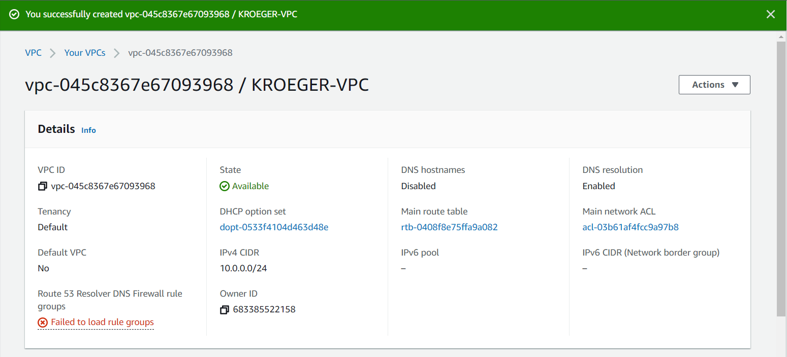
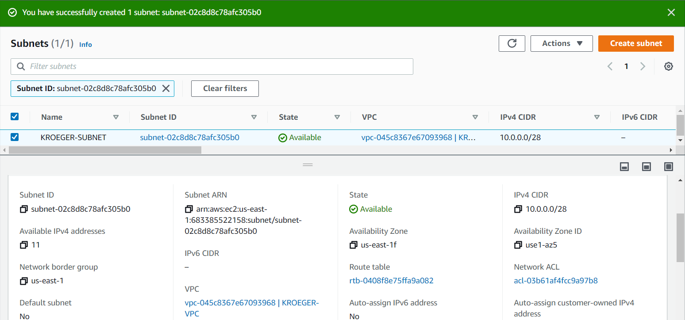
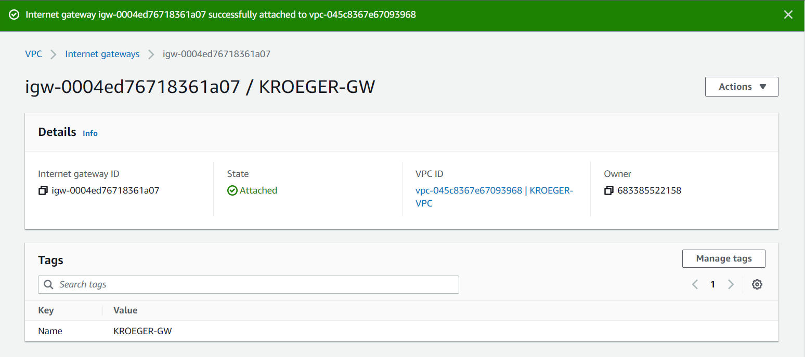
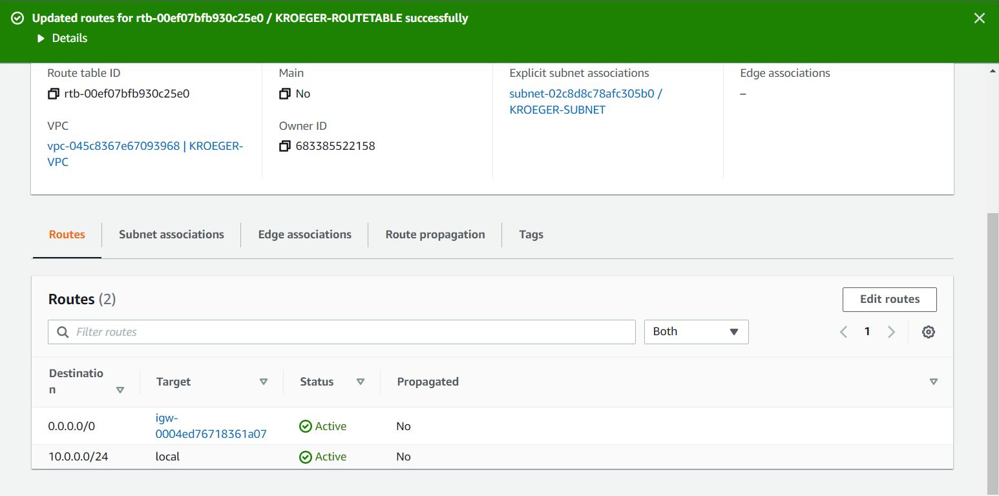
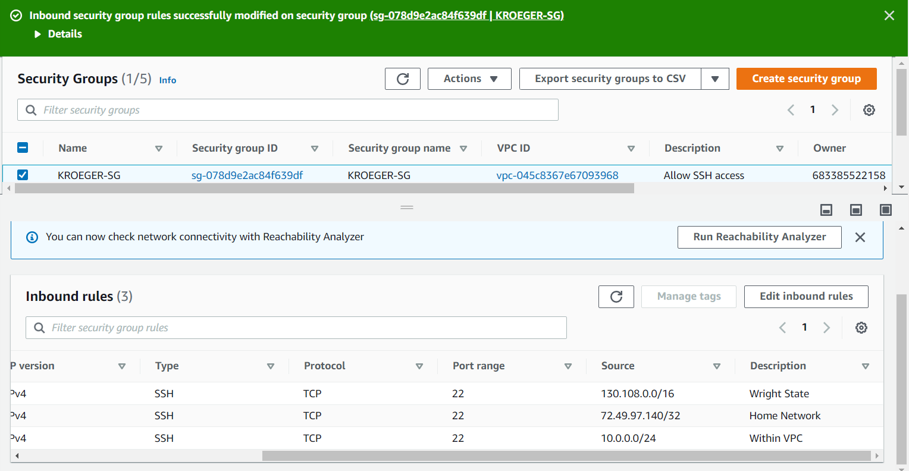
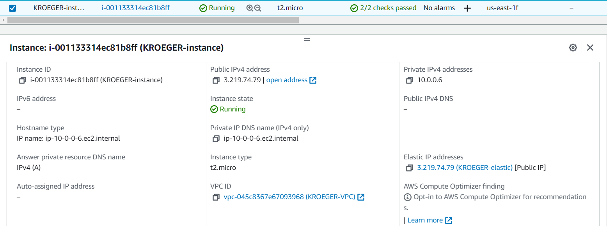
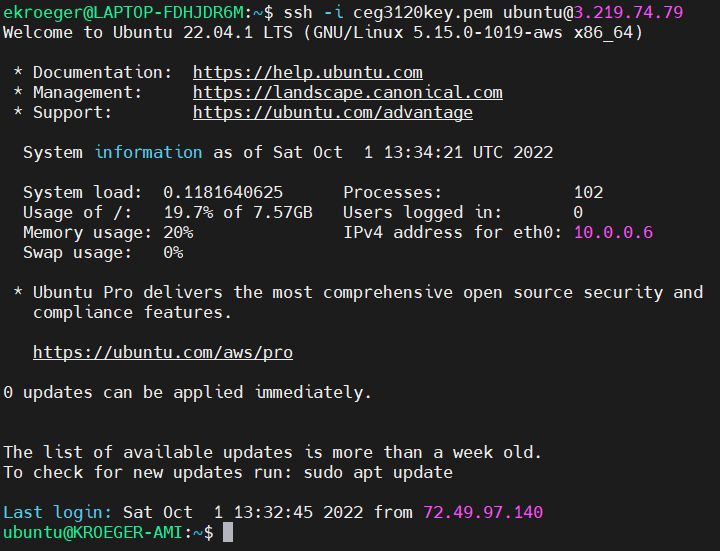

# Project 2
## Part 1 - Create a VPC
1. Create a VPC

2. Create a Subnet

3. Create an Internet Gateway

4. Create a Route Table

5. Create a Security Group

## Part 2 - Create an EC2 Instance
1. Create a new instance.
   - AMI selected
	- Ubuntu
   - Default username of the instance type selected
	- ubuntu
   - Instance type selected
	- t2.micro
2. Attatch the instance to VPC
	- In the wizard to create an EC2 instance, the Network Settings tab can be expanded to select a VPC from a drop down list
3. Determine whether a Public IPv4 address will be auto-assigned to the instance
	- It will not, as there is a setting labelled "Auto-assign public IP" that I have disabled by default, however a private IPv4 address will be allocated
4. Attach a volume to the instance
	- A volume is automatically attached at instance creation
5. Tag the instance with a "Name" of "KROEGER-instance"
	- Upon creation you can write in tags the name of your instance
6. Associate the security group with the instance
	- On createion, you can select existing security groups from a drop down list
7. Reserve an Elastic IP address
	- Created an Elastic IP address on the Elastic IP page, and then selected actions, chose associate Elastic IP, and then selected my instance
8. Create a screenshot of instance details

9. SSH into the instance and change the hostname

'''bash
 ssh -i ceg3120key.pem ubuntu@3.219.74.79
'''
	- went to the ect/hostname file and changed the name, then having to do *sudo reboot* in order to have the changes take effect
10. Screenshot of the SSH connection

